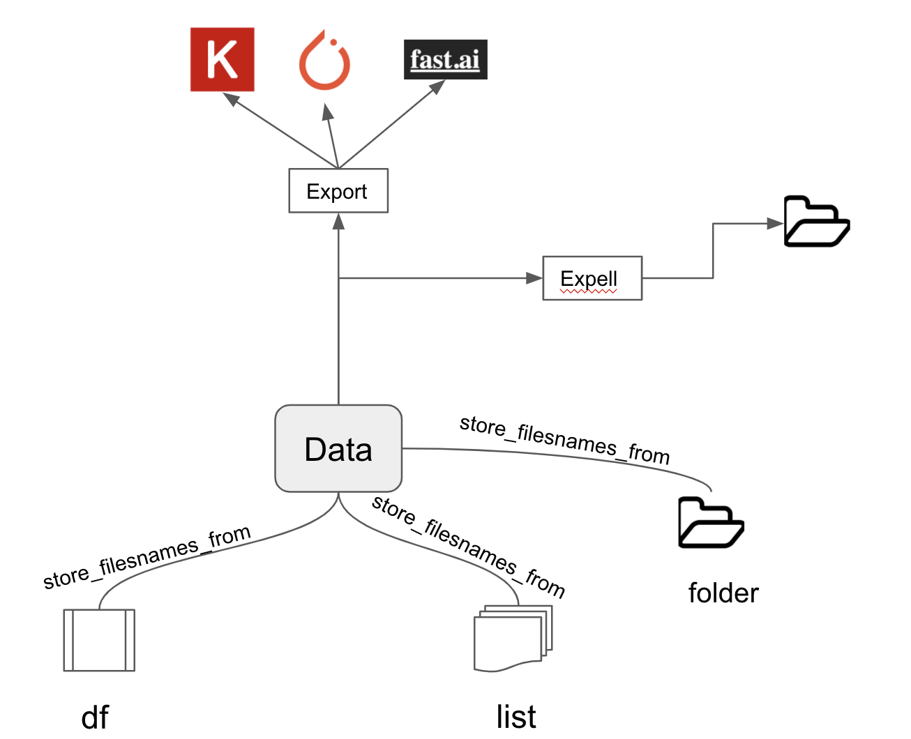

[](http://hits.dwyl.com/gianfa/cytokinin)
# cytokinin 
Promote your data rooting and make your ML projects to flourish


One of the most daunting work to do for a Deep Learning engineer is to setup an entire script from scratch for each framework, since each one presents its peculiarities.  
Here I'm talking about the most famous DL frameworks: [Keras](https://keras.io/) (Tensorflow), [Pytorch](https://pytorch.org/), [FastAI](https://docs.fast.ai/) (I love them all!).

I love DL therefore I want the freedom to use (at least) all of those frameworks with no time wasting. I want to focus on thinking about architectures and results, not coding for data structure preparations.

Introduce cytokinin, still not complete, but ready to work on images. Try it!

Check the [tutorials](./tutorials) folder to quickly get started.


## Installation
```bash
projfolder$ git clone https://github.com/gianfa/cytokinin  
projfolder$ cd cytokinin/cytokinin/
projfolder/cytokinin/cytokinin/$ pip install ./
```

## Data Flow example


Below an example of data flow is depicted. It all starts with a data loading into the Data object, then you can export your dataset to your preferred Deep Learning framework.




```bash

```
